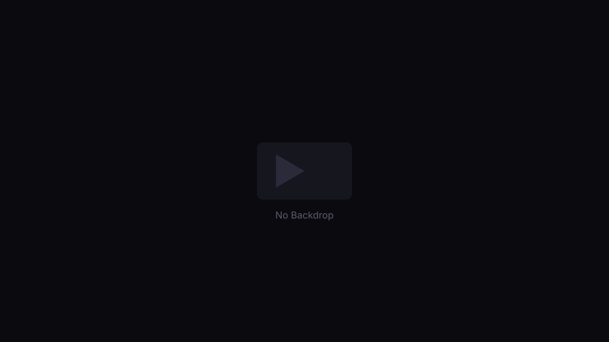

# 🎬 CineVerse

> A premium movie discovery platform built with Next.js 14, Tailwind CSS, Framer Motion, and the TMDB API.



---

## ✨ Features

- 🎥 **Cinematic Hero** — Auto-rotating hero with 8 trending movies, animated transitions, and navigation
- 🔥 **Movie Sections** — Trending, Popular, Top Rated, Upcoming — all fetched from TMDB
- 🔍 **Smart Search** — Debounced search with loading, empty, and error states
- 🎛️ **Filters** — Genre, minimum rating, and sort (popularity / rating / newest / oldest)
- 🎞️ **Movie Details Modal** — Full metadata, backdrop, trailer button, watchlist toggle
- 🍿 **YouTube Trailers** — Embedded YouTube player inside a modal
- 📌 **Watchlist** — Add/remove movies, persisted to `localStorage` across sessions
- 🌓 **Dark/Light Mode** — Toggle with localStorage persistence
- 💀 **Skeleton Loaders** — Animated skeletons while API requests complete
- ⚠️ **Graceful Fallbacks** — Demo data shown when API key is missing or calls fail
- 📱 **Fully Responsive** — Mobile, tablet, desktop, widescreen
- ♿ **Accessible** — Keyboard navigation, aria labels, escape-to-close modals
- 🎨 **Premium Design** — Glassmorphism, smooth animations, cinematic color palette

---

## 🛠️ Technologies

| Tech | Purpose |
|------|---------|
| Next.js 14 (App Router) | Framework & routing |
| TypeScript | Type safety |
| Tailwind CSS v4 | Styling |
| Framer Motion | Animations & transitions |
| Zustand | State management (watchlist, UI, theme) |
| Axios | HTTP requests to TMDB |
| Lucide React | Icons |
| TMDB API | Movie data |

---

## 🔑 TMDB API Setup

1. Create a free account at [themoviedb.org](https://www.themoviedb.org)
2. Go to **Settings → API** and request a developer API key (v3 auth)
3. Copy your API key
4. Open `.env.local` in the project root and replace `YOUR_API_KEY_HERE`:

```env
NEXT_PUBLIC_TMDB_API_KEY=your_actual_api_key
```

> **Without a key:** The app still works! It falls back to a built-in demo dataset with 12 movies.

---

## 🚀 Running Locally

```bash
# 1. Navigate to the project
cd e:/projects/MOVIE/cineverse

# 2. Install dependencies (already done)
npm install

# 3. Set up your API key (see above)
# Edit .env.local

# 4. Start the dev server
npm run dev

# 5. Open in browser
# http://localhost:3000
```

---

## 🌐 Deploying to Vercel

### Option A — Vercel CLI (Recommended)

```bash
# Install Vercel CLI
npm i -g vercel

# Deploy from project root
cd e:/projects/MOVIE/cineverse
vercel

# Follow the prompts, then set your env variable:
vercel env add NEXT_PUBLIC_TMDB_API_KEY
```

### Option B — Vercel Dashboard

1. Push this project to GitHub
2. Go to [vercel.com](https://vercel.com) → **New Project**
3. Import your repo
4. Under **Environment Variables**, add:
   - Key: `NEXT_PUBLIC_TMDB_API_KEY`
   - Value: your TMDB API key
5. Click **Deploy**

### Option C — GitHub Pages (Static Export)

Add to `next.config.ts`:
```ts
output: "export",
```
Then run `npm run build` — the `out/` folder is your static site.

---

## 📁 Project Structure

```
cineverse/
├── src/
│   ├── app/
│   │   ├── globals.css       # Design system, CSS variables, animations
│   │   ├── layout.tsx        # Root layout (providers, navbar, modals)
│   │   └── page.tsx          # Root page (view orchestration)
│   ├── components/
│   │   ├── layout/
│   │   │   └── Navbar.tsx    # Responsive navbar with search
│   │   ├── modals/
│   │   │   ├── MovieModal.tsx  # Movie detail modal
│   │   │   └── TrailerModal.tsx # YouTube trailer modal
│   │   ├── movie/
│   │   │   ├── Hero.tsx        # Auto-rotating cinematic hero
│   │   │   ├── HomeView.tsx    # Home page (fetches all sections)
│   │   │   ├── MoviesView.tsx  # Movies page with filters
│   │   │   ├── MovieCard.tsx   # Card & grid card components
│   │   │   ├── MovieRow.tsx    # Horizontal scrollable row
│   │   │   ├── SearchView.tsx  # Search results view
│   │   │   └── WatchlistView.tsx # Watchlist view
│   │   ├── providers/
│   │   │   └── ThemeProvider.tsx # Theme sync provider
│   │   └── ui/
│   │       └── Toaster.tsx     # Toast notification system
│   ├── lib/
│   │   ├── tmdb.ts            # TMDB API client & helpers
│   │   └── demoData.ts        # Fallback demo movie dataset
│   ├── store/
│   │   ├── watchlist.ts       # Zustand watchlist store (persisted)
│   │   └── ui.ts              # Zustand UI/theme/genre stores
│   └── types/
│       └── index.ts           # TypeScript types
├── public/
│   ├── placeholder-poster.svg
│   └── placeholder-backdrop.svg
├── .env.local                  # Your API key (not committed)
├── .env.example               # Template
├── next.config.ts
└── README.md
```

---

## 🔧 Configuration

The API key is centralized in `src/lib/tmdb.ts`:

```ts
export const TMDB_API_KEY = process.env.NEXT_PUBLIC_TMDB_API_KEY || "YOUR_API_KEY";
```

Change it in one place. The rest of the app uses this constant.

---

## 📄 License

MIT — Free to use and modify.

---

<p align="center">
  Made with ❤️ using <a href="https://nextjs.org">Next.js</a> + <a href="https://www.themoviedb.org">TMDB</a>
</p>
